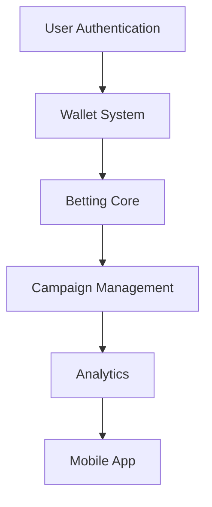
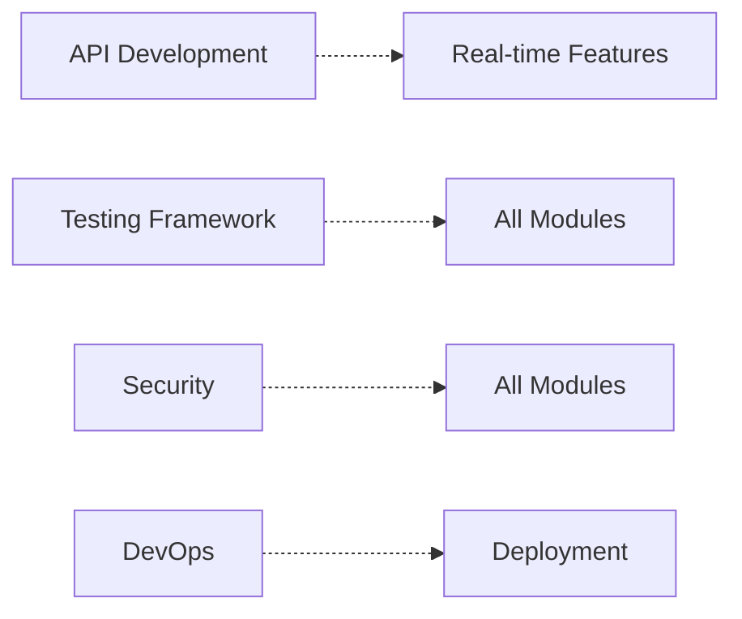

# Lộ Trình Triển Khai Hệ Thống Đặt Cược

## 🎯 Tổng quan Timeline

```mermaid
gantt
    title Lộ Trình Triển Khai 48 Tuần
    dateFormat  YYYY-MM-DD
    section Phase 1 Foundation
    User Management         :crit, done, p1a, 2024-01-01, 4w
    Financial Core          :crit, active, p1b, after p1a, 8w
    Betting Foundation      :crit, p1c, after p1b, 12w
    
    section Phase 2 Advanced
    Campaign System         :high, p2a, after p1a, 8w
    Analytics Core          :high, p2b, after p2a, 7w
    API Development         :high, p2c, after p1c, 5w
    Testing & QA            :high, p2d, after p2c, 5w
    
    section Phase 3 Enhancement
    Social Features         :med, p3a, after p2b, 8w
    Mobile App              :med, p3b, after p2d, 8w
    Business Intelligence   :med, p3c, after p3a, 5w
```

---

## 📋 Phase 1: Foundation (Tuần 1-24)

### 🏗️ Tuần 1-4: User Management
**Mục tiêu**: Hệ thống xác thực và quản lý người dùng hoàn chỉnh

#### Tuần 1: Authentication Core
```yaml
Sprint Goal: "Triển khai hệ thống xác thực cơ bản"
Deliverables:
  - Laravel Sanctum setup hoàn chỉnh
  - User registration & login APIs
  - Basic security middleware
  - Email verification system

Critical Tasks:
  - 1.1.1.1: Laravel Sanctum setup (4h) [Dev1]
  - 1.1.1.2: User model creation (2h) [Dev1] 
  - 1.1.1.3: Users table migration (1h) [Dev1]
  - 1.1.1.4: Registration API (3h) [Dev2]
  - 1.1.1.5: Login API (3h) [Dev2]
  - 1.1.1.6: Registration form UI (4h) [Dev3]
  - 1.1.1.7: Login form UI (4h) [Dev3]
  - 1.1.1.8: Email verification (3h) [Dev1]

Success Criteria:
  - ✅ Users can register and login
  - ✅ Email verification functional
  - ✅ Basic UI components ready
  - ✅ >95% test coverage
```

#### Tuần 2: Permissions & Roles
```yaml
Sprint Goal: "Triển khai hệ thống phân quyền"
Deliverables:
  - Role-based permission system
  - Admin panel for user management
  - Permission middleware
  - Role assignment APIs

Critical Tasks:
  - 1.1.2.1: Spatie Permission setup (2h) [Dev1]
  - 1.1.2.2: Roles migration (1h) [Dev1]
  - 1.1.2.3: Permissions migration (1h) [Dev1]
  - 1.1.2.4: Seed basic roles (2h) [Dev2]
  - 1.1.2.5: Seed permissions (2h) [Dev2]
  - 1.1.2.6: Role assignment API (3h) [Dev1]
  - 1.1.2.7: Permission middleware (3h) [Dev1]
  - 1.1.2.8: Role management UI (2h) [Dev3]
```

#### Tuần 3: Security Features
```yaml
Sprint Goal: "Triển khai tính năng bảo mật nâng cao"
Deliverables:
  - Two-factor authentication
  - Password reset system
  - Activity logging
  - Security monitoring

High-Priority Tasks:
  - 1.1.3.1: Google2FA package (2h) [Dev1]
  - 1.1.3.2: 2FA settings migration (1h) [Dev1]
  - 1.1.3.3: QR code generation (4h) [Dev2]
  - 1.1.3.4: TOTP verification (4h) [Dev2]
  - 1.1.3.5: 2FA setup UI (6h) [Dev3]
  - 1.1.4.1: Forgot password API (3h) [Dev1]
  - 1.1.4.3: Reset password API (3h) [Dev1]
  - 1.1.4.4: Reset password UI (4h) [Dev3]
```

#### Tuần 4: User Management Complete
```yaml
Sprint Goal: "Hoàn thiện hệ thống quản lý người dùng"
Deliverables:
  - User profile management
  - User preferences system
  - Activity logging complete
  - Notification system

Completion Tasks:
  - 1.2.1.1-1.2.1.5: User profiles (16h) [Dev1+Dev2]
  - 1.2.2.1-1.2.2.5: User preferences (16h) [Dev1+Dev2]
  - 1.3.1.1-1.3.1.6: Activity logging (16h) [Dev2+Dev3]
  - 1.3.2.1-1.3.2.6: Notifications (16h) [Dev1+Dev3]
```

### 🏗️ Tuần 5-12: Financial Management
**Mục tiêu**: Hệ thống tài chính và ví điện tử hoàn chỉnh

#### Tuần 5-6: Core Wallet System
```yaml
Sprint Goal: "Triển khai hệ thống ví cơ bản"
Focus Areas:
  - Database design for wallets
  - Core wallet functionality  
  - Balance tracking & security
  - Basic transaction handling

Week 5 Tasks:
  - 4.1.1.1: Wallets table migration (3h) [Dev1]
  - 4.1.1.2: Wallet model with balance tracking (4h) [Dev1]
  - 4.1.1.4: Balance calculation service (4h) [Dev2]
  - 4.1.1.5: Wallet locking mechanism (3h) [Dev1]
  - 4.1.1.6: Balance history tracking (3h) [Dev2]
  - 4.1.1.7: Wallet API endpoints (5h) [Dev1]
  - 4.1.1.8: Wallet dashboard UI (6h) [Dev3]

Week 6 Tasks:
  - 4.1.3.1: Transaction encryption (4h) [Dev1]
  - 4.1.3.2: PIN-based wallet access (5h) [Dev2]
  - 4.1.3.3: 2FA wallet verification (4h) [Dev1]
  - 4.1.3.4: Wallet freeze/unfreeze (3h) [Dev2]
  - 4.1.3.5: Suspicious activity detection (6h) [Dev1]
  - 4.1.3.6: Security audit logs (3h) [Dev2]
```

#### Tuần 7-8: Multi-Currency & Advanced Wallet
```yaml
Sprint Goal: "Triển khai hỗ trợ đa tiền tệ"
Focus Areas:
  - Multiple currency support
  - Exchange rate integration
  - Currency conversion logic
  - Balance reconciliation

Week 7 Tasks:
  - 4.1.2.1: Currencies table (2h) [Dev1]
  - 4.1.2.2: Exchange rate service (6h) [Dev2]
  - 4.1.2.3: Currency conversion logic (5h) [Dev1]
  - 4.1.2.4: Multi-currency display (4h) [Dev3]
  - 4.1.2.5: Currency rate caching (3h) [Dev2]
  - 4.1.2.6: Historical exchange rates (4h) [Dev2]
  - 4.1.2.7: Currency selection UI (3h) [Dev3]

Week 8 Tasks:
  - 4.1.4.1: Daily balance verification (4h) [Dev1]
  - 4.1.4.2: Discrepancy detection (5h) [Dev2]
  - 4.1.4.3: Automated reconciliation (6h) [Dev1]
  - 4.1.4.4: Manual adjustment process (4h) [Dev2]
  - 4.1.4.5: Reconciliation reporting (3h) [Dev3]
```

#### Tuần 9-10: Transaction Management
```yaml
Sprint Goal: "Triển khai hệ thống giao dịch"
Focus Areas:
  - Transaction processing engine
  - Deposit & withdrawal system
  - Transaction history & reporting
  - Fee management

Week 9 Tasks:
  - 4.2.1.1: Transactions table (3h) [Dev1]
  - 4.2.1.2: Transaction model & states (4h) [Dev1]
  - 4.2.1.3: Atomic transaction processing (6h) [Dev2]
  - 4.2.1.4: Transaction queue system (5h) [Dev1]
  - 4.2.1.5: Failed transaction handling (4h) [Dev2]
  - 4.2.1.6: Transaction retry logic (3h) [Dev1]
  - 4.2.1.7: Transaction notifications (4h) [Dev3]

Week 10 Tasks:
  - 4.2.2.1: Deposit request processing (5h) [Dev1]
  - 4.2.2.2: Withdrawal request processing (6h) [Dev2]
  - 4.2.2.4: Deposit/withdrawal limits (4h) [Dev1]
  - 4.2.2.5: Processing fee calculation (3h) [Dev2]
  - 4.2.2.6: Deposit/withdrawal UI (6h) [Dev3]
  - 4.2.3.1: Transaction listing API (3h) [Dev1]
  - 4.2.3.6: Transaction history UI (4h) [Dev3]
```

#### Tuần 11-12: Payment Integration & Risk Management
```yaml
Sprint Goal: "Tích hợp thanh toán và quản lý rủi ro"
Focus Areas:
  - Payment gateway integration
  - Risk management system
  - Fraud detection
  - Compliance features

Week 11 Tasks:
  - 4.4.1.1: Stripe integration (8h) [Dev1]
  - 4.4.1.2: PayPal integration (8h) [Dev2]
  - 4.4.1.5: Payment gateway abstraction (6h) [Dev1]
  - 4.4.1.6: Payment retry logic (4h) [Dev2]
  - 4.4.1.7: Payment reconciliation (6h) [Dev1]

Week 12 Tasks:
  - 4.3.1.1: Risk rules table (3h) [Dev1]
  - 4.3.1.2: Risk assessment engine (8h) [Dev2]
  - 4.3.1.3: Real-time risk monitoring (6h) [Dev1]
  - 4.3.1.4: Risk threshold configuration (4h) [Dev2]
  - 4.3.1.5: Automated risk actions (5h) [Dev1]
  - 4.3.1.6: Risk reporting dashboard (5h) [Dev3]
```

### 🎮 Tuần 13-24: Betting System Foundation
**Mục tiêu**: Hệ thống đặt cược cốt lõi và tự động hóa

#### Tuần 13-16: Manual Betting System
```yaml
Sprint Goal: "Triển khai hệ thống đặt cược thủ công"
Focus Areas:
  - Basic betting interface
  - Bet validation system
  - Batch betting capabilities
  - Quick bet templates

Weekly Breakdown:
Week 13: Basic betting foundation
Week 14: Validation & security
Week 15: Batch processing
Week 16: Templates & optimization
```

#### Tuần 17-20: Automated Betting Engine
```yaml
Sprint Goal: "Triển khai engine đặt cược tự động"
Focus Areas:
  - Auto-betting rule engine
  - Betting algorithms
  - Strategy execution
  - Auto-stop conditions

Weekly Breakdown:
Week 17: Rule engine core
Week 18: Algorithm implementation
Week 19: Strategy framework
Week 20: Safety & monitoring
```

#### Tuần 21-24: Historical Testing & Advanced Features
```yaml
Sprint Goal: "Triển khai backtesting và tính năng nâng cao"
Focus Areas:
  - Backtesting engine
  - Monte Carlo simulation
  - Performance analysis
  - Market data integration

Weekly Breakdown:
Week 21: Backtesting foundation
Week 22: Simulation engine
Week 23: Performance analytics
Week 24: Market integration
```

---

## 📊 Phase 2: Advanced Features (Tuần 25-40)

### 🏢 Tuần 25-32: Campaign Management
**Mục tiêu**: Hệ thống quản lý chiến dịch hoàn chỉnh

#### Implementation Strategy:
```yaml
Tuần 25-26: Campaign CRUD & Templates
Tuần 27-28: Lifecycle Management
Tuần 29-30: Monitoring & Analytics  
Tuần 31-32: Sharing & Collaboration
```

### 📈 Tuần 33-40: Analytics & API
**Mục tiêu**: Thống kê nâng cao và API hoàn chỉnh

#### Implementation Strategy:
```yaml
Tuần 33-35: Dashboard & Real-time Metrics
Tuần 36-37: Advanced Analytics & ML
Tuần 38-39: REST API Development
Tuần 40: WebSocket & Real-time Features
```

---

## 🎨 Phase 3: Enhancement (Tuần 41-48)

### 👥 Tuần 41-48: Social & Mobile
**Mục tiêu**: Tính năng xã hội và ứng dụng di động

#### Final Sprint Strategy:
```yaml
Tuần 41-42: Social Features Core
Tuần 43-44: Community & Interaction
Tuần 45-46: Mobile Application
Tuần 47-48: Business Intelligence & Deployment
```

---

## 🔄 Dependencies & Critical Path

### Tier 1 Dependencies (Must Complete First):


### Tier 2 Dependencies (Can Parallel):


### Parallel Development Opportunities:
```yaml
Week 5-12: 
  - Core Team: Financial Management
  - UI Team: User Interface polish
  - QA Team: Test automation setup

Week 13-24:
  - Backend: Betting engine
  - Frontend: Dashboard development
  - Mobile: React Native foundation

Week 25-40:
  - Full Team: Campaign & Analytics
  - DevOps: Production preparation
  - QA: Performance testing
```

---

## 🎯 Milestone Checkpoints

### Major Milestones:
```yaml
Milestone 1 (Week 4):
  Name: "Authentication & User Management Complete"
  Criteria:
    - All user management features functional
    - Security features implemented
    - >95% test coverage
    - Security audit passed

Milestone 2 (Week 12):
  Name: "Financial System Complete"
  Criteria:
    - Wallet system fully functional
    - Payment integration working
    - Risk management active
    - Load testing passed

Milestone 3 (Week 24):
  Name: "Betting Engine Complete"
  Criteria:
    - Manual & auto betting functional
    - Backtesting engine working
    - Performance benchmarks met
    - Integration testing passed

Milestone 4 (Week 40):
  Name: "Core Platform Complete"
  Criteria:
    - All core features implemented
    - API documentation complete
    - End-to-end testing passed
    - Pre-production deployment ready

Milestone 5 (Week 48):
  Name: "Full Platform Launch"
  Criteria:
    - Mobile app deployed
    - Social features active
    - BI dashboard functional
    - Production launch ready
```

### Weekly Health Checks:
```yaml
Every Friday:
  Technical Review:
    - Code quality metrics
    - Test coverage report
    - Performance benchmarks
    - Security scan results
  
  Progress Review:
    - Velocity tracking
    - Milestone progress
    - Risk assessment
    - Resource allocation

  Planning Review:
    - Next week planning
    - Dependency management
    - Team workload balance
    - Issue escalation
```

---

## 🚀 Deployment Strategy

### Environment Progression:
```yaml
Development (Continuous):
  - Feature branches
  - Unit testing
  - Code review
  - Local integration

Staging (Weekly):
  - Integration testing
  - Performance testing
  - Security testing
  - User acceptance testing

Pre-Production (Milestone):
  - Load testing
  - Security audit
  - Data migration testing
  - Disaster recovery testing

Production (Launch):
  - Phased rollout
  - Real-time monitoring
  - Performance monitoring
  - Support readiness
```

### Release Schedule:
```yaml
Alpha Release (Week 24):
  - Core betting functionality
  - Basic user management
  - Limited user testing

Beta Release (Week 40):
  - Full platform features
  - Closed beta testing
  - Performance optimization

Production Release (Week 48):
  - Public launch
  - Full monitoring
  - Support documentation
  - Marketing coordination
```

---

## 📊 Resource Allocation

### Team Composition by Phase:
```yaml
Phase 1 (Foundation):
  Backend Developers: 3 (75% allocation)
  Frontend Developers: 2 (60% allocation)
  DevOps Engineer: 1 (40% allocation)
  QA Engineer: 1 (30% allocation)

Phase 2 (Advanced):
  Backend Developers: 3 (90% allocation)
  Frontend Developers: 2 (80% allocation)
  DevOps Engineer: 1 (60% allocation)
  QA Engineer: 1 (70% allocation)
  Mobile Developer: 1 (50% allocation)

Phase 3 (Enhancement):
  Backend Developers: 2 (60% allocation)
  Frontend Developers: 2 (90% allocation)
  DevOps Engineer: 1 (80% allocation)
  QA Engineer: 1 (90% allocation)
  Mobile Developer: 1 (100% allocation)
```

### Budget Allocation:
```yaml
Development (70%):
  - Salaries & contractors
  - Development tools
  - Testing infrastructure

Infrastructure (20%):
  - Cloud services (AWS/GCP)
  - Third-party services
  - Monitoring tools

Miscellaneous (10%):
  - Training & certification
  - External consultants
  - Contingency buffer
```

---

*🗓️ Timeline: 48 weeks total*
*👥 Team: 6-8 developers*
*💰 Budget: Optimized for MVP launch*
*🎯 Goal: Production-ready betting platform* 
